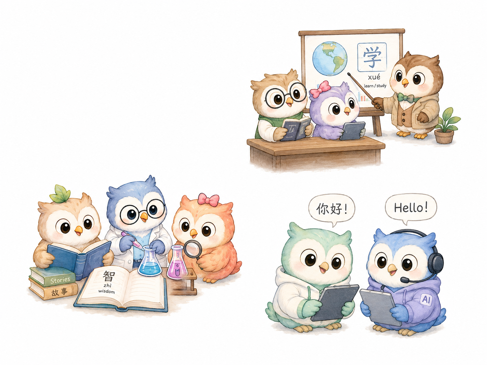

<div align="center"><a name="readme-top"></a>

# OwlNest

An AI reading agent and knowledge nest browser extension.

Translate, read, chat with voice, search the web, and build your personal knowledge nest — right in your browser.

[![English][english-shield]](./README.md) [![简体中文][chinese-shield]](./readmes/README.zh-CN.md)

[GitHub](https://github.com/DeepOrcaLab/OwlNest) · [Issues][issues-link]

<!-- SHIELD GROUP -->

[![Latest Version badge][extension-release-shield]][github-release-link]
[![GPL-3.0 License badge][license-shield]](./LICENSE)
[![TypeScript badge][ts-shield]][github-release-link]
[![Stars badge][star-history-shield]][star-history-link]
[![Contributors badge][contributors-shield]][contributors-link]
![Last Commit badge][last-commit-shield]
[![Issues badge][issues-shield]][issues-link]

</div>

<details>
<summary><kbd>Table of contents</kbd></summary>

- [Demo](#demo)
- [Getting Started](#getting-started)
- [Features](#features)
  - [Web Translation](#web-translation)
  - [Selection Translation](#selection-translation)
  - [OwlNest Agent Chat](#owlnest-agent-chat)
  - [Voice Input](#voice-input)
  - [Text-to-Speech (TTS)](#text-to-speech-tts)
  - [Web Search](#web-search)
  - [Knowledge Nest](#knowledge-nest)
  - [Page Export](#page-export)
  - [Multi-Provider Support](#multi-provider-support)
  - [Subtitle Translation](#subtitle-translation)
- [🧑‍💻 Development](#-development)
- [📜 Credits](#-credits)
- [📄 License](#-license)

</details>

## Demo

<div align="center">
  
</div>

## Getting Started

OwlNest is an open-source AI browser extension that transforms your everyday web reading. Beyond translation, it gives you a side panel AI agent, voice input, web search, and a local knowledge nest to save and organize what you learn.

### Download

| Browser | Version                                                                | Download                                 |
| ------- | ---------------------------------------------------------------------- | ---------------------------------------- |
| Chrome  | [![Chrome Version badge][chrome-version-shield]][chrome-store-link]    | [Chrome Web Store][chrome-store-link]    |
| Edge    | [![Edge Version badge][edge-version-shield]][edge-store-link]          | [Microsoft Edge Addons][edge-store-link] |
| Firefox | [![Firefox Version badge][firefox-version-shield]][firefox-store-link] | [Firefox Add-ons][firefox-store-link]    |

### Community

| [![Discord badge][discord-shield-badge]][discord-link] | In Discord ask questions, and connect with developers. |
| :----------------------------------------------------- | :----------------------------------------------------- |

> \[!IMPORTANT]
>
> **⭐️ Star Us**, You will receive all release notifications from GitHub without any delay \~

[![Star OwlNest on GitHub][image-star]][github-star-link]

<details>
<summary><kbd>Star History</kbd></summary>

<a href="https://www.star-history.com/#DeepOrcaLab/OwlNest&Timeline">
 <picture>
   <source media="(prefers-color-scheme: dark)" srcset="https://api.star-history.com/svg?repos=DeepOrcaLab/OwlNest&type=Timeline&theme=dark" />
   <source media="(prefers-color-scheme: light)" srcset="https://api.star-history.com/svg?repos=DeepOrcaLab/OwlNest&type=Timeline" />
   
 </picture>
</a>

</details>

<div align="right">

[![Back to top][back-to-top]](#readme-top)

</div>

## Features

### Web Translation

Translate entire web pages or specific content with two display modes. **Bilingual mode** shows original text alongside its translation. **Translation-only mode** gives you a clean, immersive reading experience. Switch seamlessly without refreshing.

### Selection Translation

Select any text on a webpage to reveal a smart toolbar. **Translate** streams the result in real-time. **Explain** provides detailed explanations. **Speak** reads text aloud with TTS. The toolbar auto-positions within the viewport and supports drag.

### OwlNest Agent Chat

Open the side panel to chat with an AI agent that understands the page you're reading. Ask questions, get summaries, or explore topics — all with full awareness of the current page content.

### Voice Input

Speak your questions naturally. OwlNest converts speech to text and feeds it to the AI agent. Supports Chinese (中文) and English voice recognition.

### Text-to-Speech (TTS)

Listen to selected text with 150+ high-quality AI voices across 80+ languages. Powered by **Edge TTS** — completely free. Adjustable rate, pitch, and volume.

### Web Search

Enable web search for real-time information. Ask about news, events, or facts — OwlNest fetches current results. Tools show live status indicators as they work.

### Knowledge Nest

Save important content to your local Knowledge Nest. Capture selected text, translations, AI responses, or whole page content. AI-generated tags and topics help organize your knowledge. Browse, search, edit, and export — all stored locally in your browser.

### Page Export

Export the current page or your entire Knowledge Nest to **Markdown** or **PDF**. Clean, readable formatting perfect for sharing or archiving.

### Multi-Provider Support

Connect to popular AI providers or any OpenAI-compatible API. Example providers include DeepSeek, OpenAI, MiMo, OpenRouter, Zhipu GLM, Moonshot, Qwen, SiliconFlow, and custom endpoints.

Plus free translation: Google Translate, Microsoft Translate, and DeepLX.

### Subtitle Translation

Translate YouTube subtitles directly in the video player with real-time bilingual display.

<div align="right">

[![Back to top][back-to-top]](#readme-top)

</div>

## 🧑‍💻 Development

```bash
# Install dependencies
pnpm install

# Start dev server
pnpm dev

# Build for production
WXT_SKIP_ENV_VALIDATION=true pnpm build

# Type check
pnpm typecheck

# Run tests
pnpm test
```

### Load in Chrome

1. Open `chrome://extensions`
2. Enable **Developer mode**
3. Click **Load unpacked**
4. Select the `.output/chrome-mv3` directory

<div align="right">

[![Back to top][back-to-top]](#readme-top)

</div>

## 📜 Credits

OwlNest is a modified project based on **Read Frog**:

https://github.com/mengxi-ream/read-frog

Thanks to the original Read Frog authors and contributors. This project preserves the original GPLv3 license notice.

Major changes in OwlNest include:

- Rebranded UI from Read Frog → OwlNest
- Added OwlNest Agent side panel with page-aware chat
- Added Knowledge Nest for local knowledge capture
- Added save-to-knowledge workflow with AI-generated tags/topics
- Added page export to Markdown and PDF
- Added voice input and TTS improvements
- Added web search tool integrations
- Added agent tool workflow with live status indicators
- Updated onboarding, branding assets, and multi-language support
- Unified icon library and theme token system

<div align="right">

[![Back to top][back-to-top]](#readme-top)

</div>

## 📄 License

OwlNest is licensed under the **GNU General Public License v3.0 (GPL-3.0)**.

See [LICENSE](./LICENSE) for the full text.

<!-- LINK GROUP -->

[back-to-top]: https://img.shields.io/badge/-BACK_TO_TOP-151515?style=flat-square
[chrome-store-link]: https://chromewebstore.google.com/detail/read-frog-open-source-ai/modkelfkcfjpgbfmnbnllalkiogfofhb
[chrome-version-shield]: https://img.shields.io/chrome-web-store/v/modkelfkcfjpgbfmnbnllalkiogfofhb?style=flat-square&label=Chrome%20Version&labelColor=black&color=yellow
[contributors-link]: https://github.com/DeepOrcaLab/OwlNest/graphs/contributors
[contributors-shield]: https://img.shields.io/github/contributors/DeepOrcaLab/OwlNest?style=flat-square&labelColor=black
[chinese-shield]: https://img.shields.io/badge/%E7%AE%80%E4%BD%93%E4%B8%AD%E6%96%87-gray?style=flat-square
[discord-link]: https://discord.gg/ej45e3PezJ
[discord-shield-badge]: https://img.shields.io/badge/chat-Discord-5865F2?style=for-the-badge&logo=discord&logoColor=white&labelColor=black
[edge-store-link]: https://microsoftedge.microsoft.com/addons/detail/read-frog-open-source-a/cbcbomlgikfbdnoaohcjfledcoklcjbo
[english-shield]: https://img.shields.io/badge/English-gray?style=flat-square
[firefox-store-link]: https://addons.mozilla.org/firefox/addon/read-frog-open-ai-translator/
[firefox-version-shield]: https://img.shields.io/amo/v/read-frog-open-ai-translator?style=flat-square&label=Firefox%20Version&labelColor=black&color=orange
[edge-version-shield]: https://img.shields.io/badge/dynamic/json?style=flat-square&logo=microsoft-edge&label=Edge%20Version&query=%24.version&url=https%3A%2F%2Fmicrosoftedge.microsoft.com%2Faddons%2Fgetproductdetailsbycrxid%2Fcbcbomlgikfbdnoaohcjfledcoklcjbo&labelColor=black&prefix=v
[extension-release-shield]: https://img.shields.io/github/package-json/v/DeepOrcaLab/OwlNest?filename=package.json&style=flat-square&label=Latest%20Version&color=brightgreen&labelColor=black
[github-release-link]: https://github.com/DeepOrcaLab/OwlNest/releases
[github-star-link]: https://github.com/DeepOrcaLab/OwlNest/stargazers
[image-star]: ./assets/star.png
[issues-link]: https://github.com/DeepOrcaLab/OwlNest/issues
[issues-shield]: https://img.shields.io/github/issues/DeepOrcaLab/OwlNest?style=flat-square&labelColor=black
[last-commit-shield]: https://img.shields.io/github/last-commit/DeepOrcaLab/OwlNest?style=flat-square&label=commit&labelColor=black
[license-shield]: https://img.shields.io/github/license/DeepOrcaLab/OwlNest?style=flat-square&label=License&color=green&labelColor=black
[ts-shield]: https://img.shields.io/badge/TypeScript-3178C6?style=flat-square&logo=typescript&logoColor=white&labelColor=black
[star-history-link]: https://www.star-history.com/#DeepOrcaLab/OwlNest&Timeline
[star-history-shield]: https://img.shields.io/github/stars/DeepOrcaLab/OwlNest?style=flat-square&label=stars&color=yellow&labelColor=black
